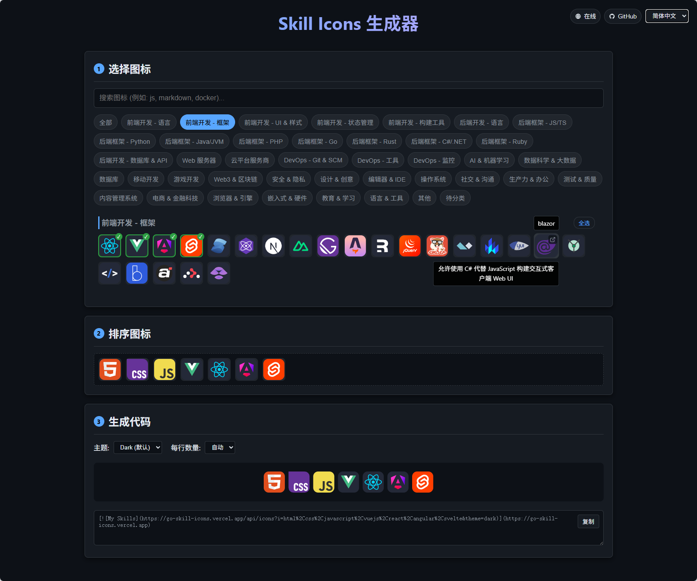

# 技能图标生成器 (Skill Icons Generator)

[English](README.md) | 简体中文

---

一个现代化、互动式的 Web 工具，帮助你为 [skill-icons](https://github.com/LelouchFR/skill-icons) 挑选、排序并生成 Markdown 代码。

🌟 **在线体验： [https://evgo2017.com/skill-icons-picker](https://evgo2017.com/skill-icons-picker)**

### 🚀 核心功能
- **图标挑选**：浏览并搜索数百个技术栈图标。
- **互动排序**：通过拖拽方式按你喜欢的顺序排列图标。
- **实时预览**：立即查看图标在个人主页上的显示效果。
- **代码生成**：一键复制生成的 Markdown 代码，可直接用于 GitHub Profile。
- **多语言支持**：支持英文和简体中文切换。
- **动态主题**：支持为生成的图标切换亮色 (Light) 和暗色 (Dark) 主题。

### 🔄 更新机制
本项目采用自动化更新与手动分类相结合的模式：
1. **自动化图标同步**：通过 GitHub Actions 每天自动从 `LelouchFR/skill-icons` 官方仓库获取最新图标。
2. **自动待分类**：新同步到的图标会默认放入 **"Uncategorized" (待分类)** 区域。
3. **维护与分类**：如需将图标移动到特定分组（如“前端”、“后端”）：
    - 修改 `config/categories.json`，将图标 ID 从 `"Uncategorized"` 移动到目标分类中。
    - 构建系统（或执行 `npm run generate`）会调用 `generate-icons.mjs` 根据新的分类手动生成 `dist/icons` 下的分片 JSON（manifest/chunks/names/locales）。
    - **这是提交 Pull Request 进行贡献的主要方式！**

### 🛠️ 开发与部署
- **部署**：通过 GitHub Actions 自动构建并发布到 GitHub Pages。

#### 本地开发
1. 克隆仓库。
2. 安装依赖：`npm install`。
3. (可选）手动同步图标：`python sync_icons.py`。
4. 手动生成图标数据：`npm run generate`。
5. 本地开发前请先执行一次 `npm run generate`（dev 模式会读取 `generated-icons/manifest.json`）。
6. 启动开发服务器：`npm run dev`。
