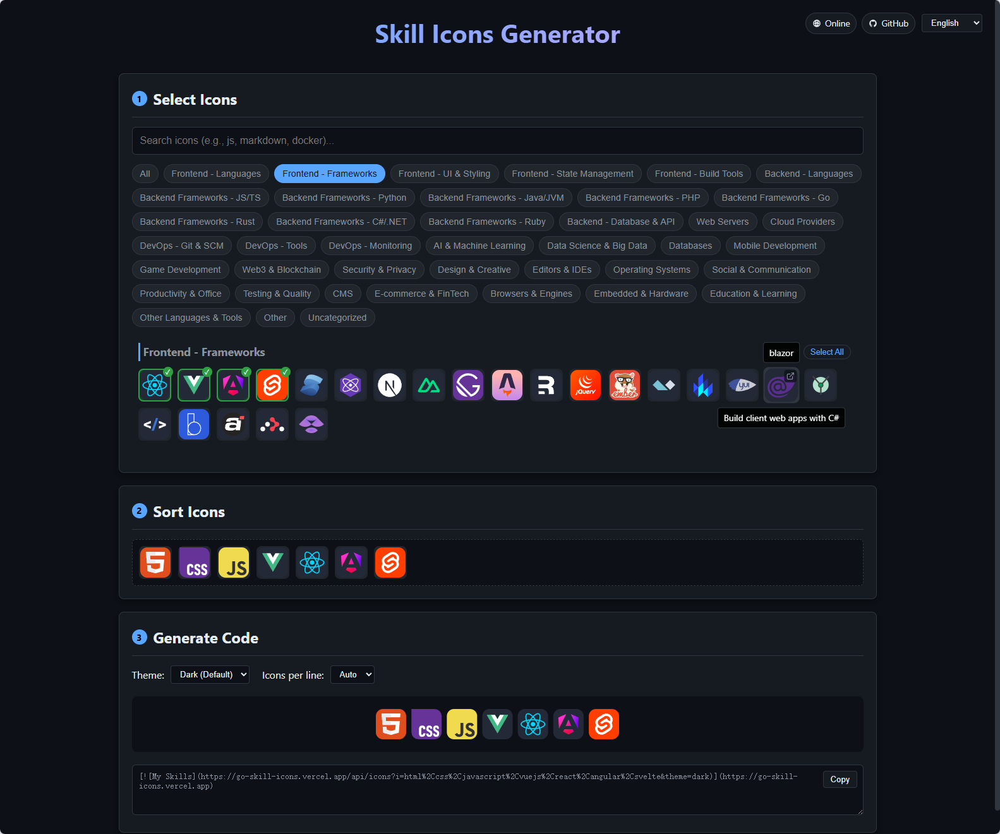

# Skill Icons Picker

English | [简体中文](README-zh.md)

---

Pick icons, drag to sort, and automatically generate Markdown code.

🌟 **Live Demo: [https://evgo2017.com/skill-icons-picker](https://evgo2017.com/skill-icons-picker)**

### 🚀 Key Features
- **Icon Picker**: Browse and search through hundreds of technology icons.
- **Interactive Sorting**: Drag and drop icons to arrange them exactly how you want.
- **Live Preview**: Instantly see how your icons will look on your profile.
- **Code Generation**: One-click to copy the Markdown code for your GitHub profile.
- **Multi-language Support**: Supports English and Simplified Chinese.
- **Dynamic Themes**: Toggle between Light and Dark modes for your generated icons.

### 🔄 Update Mechanism
This project is designed for low-maintenance consistency with the upstream source:
1. **Automated Icon Sync**: A GitHub Action runs daily to fetch the latest icons from the official [LelouchFR/skill-icons](https://github.com/LelouchFR/skill-icons) repository.
2. **Auto-Categorization**: Newly discovered icons are automatically added to the **"Uncategorized"** section.
3. **Maintenance & Categorization**: To move icons to specific groups (e.g., "Frontend", "Backend"):
    - Update the `config/categories.json` file by moving the icon ID from `"Uncategorized"` to your target category.
    - The build process (or `npm run generate`) will use `generate-icons.mjs` to generate split icon data files under `dist/icons` (manifest/chunks/names/locales).
    - **This is the primary way to contribute via Pull Requests!**

### 🛠️ Development & Deployment
- **Deployment**: Automatically built and deployed to GitHub Pages via GitHub Actions.

#### Local Setup
1. Clone the repository.
2. Install dependencies: `npm install`.
3. (Optional) Sync icons manually: `python sync_icons.py`.
4. Regenerate icon data: `npm run generate`.
5. For local dev data, generate once first: `npm run generate` (the app reads from `generated-icons/manifest.json` in dev mode).
6. Run dev server: `npm run dev`.

### Credits & License

- **Icon Source Project**: [LelouchFR/skill-icons](https://github.com/LelouchFR/skill-icons)
- **This Project**: This tool is open-sourced under the GNU General Public License v3.0 (GPL-3.0). See the [LICENSE](./LICENSE.txt) file for details.
